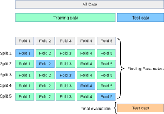

```{r setup, include=FALSE}
library(reticulate)
library(gt)
library(magrittr)
library(tidyselect)
library(dplyr)
library(stringr)
library(glue)
use_condaenv("rstudio", required = TRUE, conda = "C:/Users/Admin/miniconda3/bin/conda")
# use_python("C:\Users\Admin\miniconda3\envs\rstudio/python.exe") 
```

In [Why do cross-validation](../why-do-cross-validation/), I described cross-validation as a way of evaluating your modeling workflow from start to end to help you pick the appropriate model and avoid overfitting on your test set. No single model from the cross-validation process should actually be used as your final model[^1]; cross-validation is merely a way to evaluate how well your modeling process works on repeated samples of your data, to get a better sense of how well your modeling choice works in the real world.

[^1]: The unfortunate and unintended consequence of the wonderful `GridSearchCV()` class is that data scientists think that you can predict from a grid search process, and when they are pressed about where the 'final model' from a cross-validated process comes from, they may wonder, is it an ensemble model averaged across the folds, or are the hyperparameters averaged, or ...????

If you're comparing estimator-to-estimator without tuning much, you're at pretty low risk of overestimating model performance from model selection, so long as you don't peek at your test set. Suppose I had three simple models:

```{python include=FALSE}
from sklearn.naive_bayes import GaussianNB
from sklearn.linear_model import LogisticRegression
from sklearn.ensemble import RandomForestClassifier
from sklearn.datasets import load_breast_cancer
from sklearn.model_selection import cross_val_score, KFold, GridSearchCV
from sklearn.svm import SVC

import pandas as pd 

X, y = load_breast_cancer(return_X_y=True) 

nb = GaussianNB()
lr = LogisticRegression()
rf = RandomForestClassifier()

# by default we get 5-fold CV 
nb_scores = cross_val_score(nb, X, y, scoring="accuracy")
lr_scores = cross_val_score(lr, X, y, scoring="accuracy")
rf_scores = cross_val_score(rf, X, y, scoring="accuracy")

```

``` python
from sklearn.naive_bayes import GaussianNB
from sklearn.linear_model import LogisticRegression
from sklearn.ensemble import RandomForestClassifier
from sklearn.datasets import load_breast_cancer
from sklearn.model_selection import cross_val_score, KFold, GridSearchCV
from sklearn.svm import SVC

import pandas as pd 

X, y = load_breast_cancer(return_X_y=True) 

nb = GaussianNB()
lr = LogisticRegression()
rf = RandomForestClassifier()

# by default we get accuracy over 5-fold CV 
nb_scores = cross_val_score(nb, X, y, scoring="accuracy")
lr_scores = cross_val_score(lr, X, y, scoring="accuracy")
rf_scores = cross_val_score(rf, X, y, scoring="accuracy")
```

```{python}
dict(zip(
  ["GaussianNB", "LogisticRegression", "RandomForestClassifier"], 
  [round(i, 3) for i in [nb_scores.mean(), lr_scores.mean(), rf_scores.mean()]]
))
```

From the scores above, it seems that RandomForestClassifier should perform best out-of-sample.

## What about hyperparameter tuning?

I specifically chose these three estimators because they require minimal tuning. However, modern gradient boosting frameworks such as LightGBM and XGBoost have [a lot of hyperparameters to choose from](https://sites.google.com/view/lauraepp/parameters), and rarely do modellers have ways to guide hyperparameter choices.

Taking elastic net as an example, where the regularization term is a mix of L1 and L2 penalties:

$$
\sum_{i=1}^{n} \big( y^{(i)} - \hat{y}^{(i)}  \big)^2 + \lambda_1 \sum^{m}_{j=1} w_{j}^2+ \lambda_2 \sum^{m}_{j=1} |w_j|
$$ which is sometimes restated to establish a 'mixing parameter' $\alpha$ (e.g. glmnet):

$$
\sum_{i=1}^{n} \big( y^{(i)} - \hat{y}^{(i)}  \big)^2 + \lambda\left[ \frac {1-\alpha}{2}\sum^{m}_{j=1} w_{j}^2+\alpha \sum^{m}_{j=1} |w_j|\right]
$$

The choice between L1 and L2 regularization can be guided by our hypotheses of how the feature set affects the target. For instance, if many features do not affect the target, a higher mix of L1 penalty may be more appropriate, whereas if each feature contributes a little to the target, the L2 penalty would be more appropriate. However, it is not clear how to pick the regularization term $\lambda$.

## Grid Search

The standard response to this is to perform a grid search on your hyperparameters. In scikit-learn, this can be done by fitting a GridSearchCV object.

```{python}
parameters = {'kernel':('linear', 'rbf'), 'C':[1, 10]}
svc = SVC()
clf = GridSearchCV(svc, parameters)
clf.fit(X, y)
```

What does GridSearchCV do? Going to the scikit-learn documentation:

> It is possible and recommended to search the hyper-parameter space for the best cross validation score.

and ...

> exhaustively generates candidates from a grid of parameter values specified with the param_grid parameter

```{python}
params_df = pd.DataFrame(clf.cv_results_["params"])
result = pd.DataFrame({key: value for key, value in clf.cv_results_.items() if key.startswith("split")})
res = pd.concat([params_df, result], axis=1)
```

Essentially:

1.  You construct a grid of hyperparameter values:

    | C   | kernel |
    |-----|--------|
    | 1   | linear |
    | 1   | rbf    |
    | 10  | linear |
    | 10  | rbf    |

2.  you perform a 5-fold cross validation, building a model on each combination of 4 of the 5 folds and evaluating the model on the remaining fold:

    ```{r echo=FALSE, message=FALSE, warning=FALSE}
    py$res %>% 
      rename_with(
        .fn = function(x) paste0("fold", str_extract(x, "\\d")), 
        .cols = starts_with("split")
        ) %>% 
      rowwise() %>% 
      mutate(cv = mean(c_across(fold0:fold4))) %>%
      gt() %>%
      # update with rstudio/gt#611
      fmt_number(columns = vars(fold0, fold1, fold2, fold3, fold4, cv), decimals = 3)
    ```

3.  pick the best combination of hyperparameters[^2]

4.  **REFIT** the model on the WHOLE dataset[^3].

[^2]: presumably based on the average score between folds: this is unclear from the documentation but the numbers match up

[^3]: this is the default, set as False if you do not want the refitting. In the case of multiple metrics, refit should be a string denoting the metric you want to use to find the best estimator.

## Putting the 'tuning' in hyperparameter tuning

In practice, the data scientist probably does a little more than that. Recall that grid search exhausts the search space we specify. Since we specified two values for both `C` and `kernel`, the size of the grid is merely 4. A continuous search space is infinitely large :-(

### You, the data scientist

You may not be satisfied with the predictive performance of the model we obtain, and as such you may try to search around the search space for a better hyperparameter value.

Suppose you start with

``` python
parameters = {'kernel':('linear', 'rbf'), 'C':[1, 10]}
```

find out RBF and C = 10 were selected by your search process, then proceed to run

``` python
parameters = {'kernel': 'rbf', 'C':[9, 10, 11]}
```

hoping to get better performance.

The problem is that you are almost certain to get better performance, since you are optimizing for the same cross-validation scheme. We've violated the rule that cross-validation is just for evaluation, and inadvertently used it for optimizing our model!

### Wait ... what just happened?

To see why this is an issue, let's simplify this problem a little by substituting cross-validation with a validation set approach. Suppose you used a train-validation split on your data and used the test score to guide your hyperparameter choice. And suppose our results looked a little like:

| C   | kernel | test score |
|-----|--------|------------|
| 1   | linear | .95        |
| 1   | rbf    | .91        |
| 10  | linear | .96        |
| 10  | rbf    | .90        |

Now you know that 10 and linear are optimal, so you search around the vicinity of C = 10.

| C   | kernel | test score |
|-----|--------|------------|
| 8   | linear | .92        |
| 9   | linear | .93        |
| 10  | linear | .96        |
| 11  | linear | .97        |

This has muddied the train-evaluation distinction. We 'train' our model using our observations for the evaluation set. You'd be hacking the test set for the best score, and the test score loses its efficacy as an indicator of your model's performance. We will choose the hyperparameter that performs best on the test set, but its generalizability is questionable.

### Can cross-validation save us?

Using cross-validation may not be enough. Suppose we had cross-validation split 1 with the following evaluation scores:

| C   | kernel | cross-validated |
|-----|--------|-----------------|
| 1   | linear | .95             |
| 1   | rbf    | .91             |
| 10  | linear | .96             |
| 10  | rbf    | .90             |

and again searched around the vicinity of C = 10:

| C   | kernel | cross-validated |
|-----|--------|-----------------|
| 8   | linear | .92             |
| 9   | linear | .93             |
| 10  | linear | .96             |
| 11  | linear | .97             |

you would be selecting the hyperparameters that are optimal for the cross-validation setup, since the hyperparameter *optimization* process shares the same cross-validation setup as the hyperparameter *evaluation* process. This time, instead of hacking the test set, you're hacking the cross-validation setup.

As a result, the cross-validation error you obtain from this process would be **overoptimistic**.

## Nested CV

Nested CV tries to fix this problem by integrating both training and model selection as part of the model fitting procedure.

[.")](https://www.biorxiv.org/content/10.1101/2019.12.31.891895v1.full)

@parvandeh2020a

Nested CV may seem complicated, but bear with me for a while.

### Vanilla CV

in nested CV, the model is inclusive of the hyperparameter search process, in particular the search space you specify for the hyperparameter search. Instead of cross-validating a set of hyperparameters, we want to benchmark the performance of a hyperparameter search process over K folds of the dataset. This brings us back to the standard cross-validation definition:

{width="628"}

1.  Train the hyperparameter search process on folds 2-5, then test on fold 1;
2.  Train the hyperparameter search process on folds 1, 3-5, then test on fold 2;
3.  Train the hyperparameter search process on folds 1-2, 4-5, then test on fold 3;
4.  Train the hyperparameter search process on folds 1-3, 5; then test on fold 4;
5.  Train the hyperparameter search process on folds 1-4; then test on fold 5;

and finally, average the performance on each of the test folds.

### Bringing in hyperparameter search

Now, we would like the hyperparameter search process to be cross-validated as well. So within the hyperparameter search process, we define a different cross-validation configuration. In scikit-learn, this will look like:

```{python}
p_grid = {
  "C": [1, 10, 100],
  "kernel": ["rbf", "linear"]
}
          
svm = SVC()
inner_cv = KFold(n_splits=4, shuffle=True)
outer_cv = KFold(n_splits=4, shuffle=True)
clf = GridSearchCV(estimator=svm, param_grid=p_grid, cv=inner_cv)
nested_score = cross_val_score(clf, X=X, y=y, cv=outer_cv)
print(nested_score)
```

And once you've found a search space you're happy with, refit the GridSearchCV object:

```{python}
clf.fit(X, y)
clf.best_params_
```

What is the consequence of this?

1.  **Each of the folds may have a different set of hyperparameters.** This is perfectly fine, as we are now trying to evaluate which hyperparameter search space/process works best, not which set of hyperparameters works best.
2.  The final test set may have another set of hyperparameters.
3.  When you eventually retrain on all the data you have, you may get a different set of hyperparameters! But that's okay, because at the end of the day, we're evaluating a process for fitting the model, not a set of hyperparameters.

## What next?

@cawley2010 note that high variance algorithms are more susceptible to overfitting in model selection. This should be troubling for machine learning practitioners, as we like our high-variance algorithms for being able to capture complexity that's missed by traditional high-bias, low-variance algorithms like linear regression.

Nested CV can be computationally expensive, and it's difficult to explain to stakeholders why you'd report a development sample score with different hyperparameters for each fold.

Some alternatives include:

1.  regularization
2.  early stopping
3.  ensemble modelling
4.  hyperparameter averaging.

However, in the age of increasingly configurable gradient boosting frameworks such as XGBoost and CatBoost, it's hard to see any one of these alternatives being sufficient to curb overfitting in model selection.
