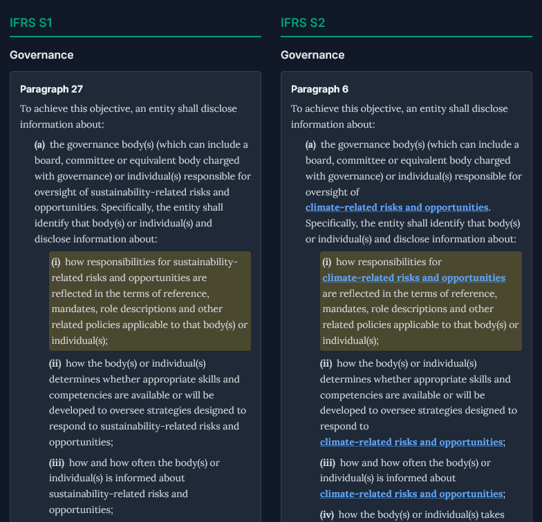
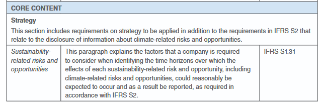
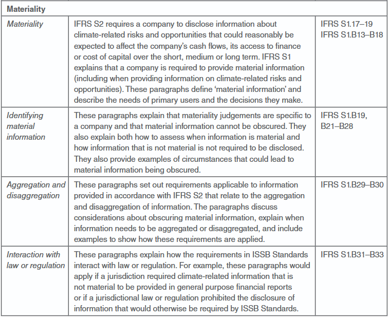
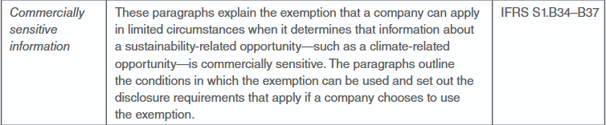

I have repeated this too many times to people who should know better. So here it is in writing.

Start with [S1.56](https://www.ifrs.org/content/dam/ifrs/publications/pdf-standards-issb/english/2025/issued/part-a/issb-2023-a-ifrs-s1-general-requirements-for-disclosure-of-sustainability-related-financial-information.pdf#page=18):

> In identifying applicable disclosure requirements about a sustainability-related risk or opportunity that could reasonably be expected to affect an entity's prospects, an entity shall apply the IFRS Sustainability Disclosure Standard that specifically applies to that sustainability-related risk or opportunity.

For climate, that standard is S2.

The obligation flows from S1 to S2. Not the other way around.

Any suggestion that transition relief allows you to apply S2 independently of S1 inverts this entirely. S1 is not optional under relief. Its scope is temporarily narrowed—from "all sustainability-related risks" to "climate-related risks only"—but you are still applying S1. [S1.E5](https://www.ifrs.org/content/dam/ifrs/publications/pdf-standards-issb/english/2025/issued/part-a/issb-2023-a-ifrs-s1-general-requirements-for-disclosure-of-sustainability-related-financial-information.pdf#page=45) makes this explicit:

> In the first annual reporting period in which an entity applies this Standard, the entity is permitted to disclose information on only climate-related risks and opportunities (in accordance with IFRS S2) and consequently apply the requirements in this Standard only insofar as they relate to the disclosure of information on climate-related risks and opportunities.

Notice the phrasing: "consequently apply the requirements in this Standard only insofar as they relate to..." It is deliberately awkward. Why? Because they need to be unambiguous: you do not stop applying S1. You apply it as it relates to climate.

Transition relief narrows S1 to climate. It does not replace S1 with S2.

The January 2025 educational material [*Applying IFRS S1 when reporting only climate-related financial disclosures*](https://www.ifrs.org/content/dam/ifrs/supporting-implementation/issb-standards/applying-ifrs-s1-reporting-only-climate-related-disclosures-accordance-ifrs-s2.pdf) (it's in the name!) confirms this reading:

> Companies choosing to apply this transition relief **are required to apply the requirements of IFRS S1** insofar as they relate to disclosing information about climate-related risks and opportunities in accordance with IFRS S2.

The May 2024 [Inaugural Jurisdictional Guide](https://www.ifrs.org/content/dam/ifrs/supporting-implementation/adoption-guide/inaugural-jurisdictional-guide.pdf#page=34) is far more blunt:

> IFRS S1 enables an entity to disclose information on only climate- related risks and opportunities (in accordance with IFRS S2) in the first annual reporting period in which the entity applies IFRS S1.

Still not convinced? Look at the evidence:

-   ISSB did a global find-and-replace. The core architecture of S1—governance, strategy, risk management, metrics and targets—was copied into S2. "Sustainability" became "climate." Same structure. Same logic. Just scoped down.

-   AASB literally copied S1 criteria back into S2. The Australian standard-setters found the dependency so critical they removed all doubt by embedding S1's requirements directly into their adoption of S2.

> [AASB S2 *Climate-related Disclosures*](https://www.legislation.gov.au/F2024L01472/asmade/downloads) is mandatory for sustainability reporting under the Act.  [AASB S1 *General Requirements for Disclosure of Sustainability-related Financial Information*](https://standards.aasb.gov.au/sites/default/files/2024-09/AASBS1_09-24_0.pdf) is voluntary. AASB S2 includes those parts of AASB S1 relevant to climate disclosures.
>
> <https://www.auasb.gov.au/implementation-support/sustainability-assurance/>

-   Critical conceptual gaps remain. Even in core content areas like governance, strategy and risk management—even if you set aside the qualitative characteristics of sustainability-related financial information—S2 assumes concepts that only S1 fully articulates. **You cannot faithfully execute S2 without them.** For example, look at the context required for time horizon definitions:

S2 tells you what climate information to disclose, but **S1 (paras 17–19)** tells you *if* it’s material enough to mention. Without S1, you have no definition of materiality, no guidance on 'primary users,' and no threshold for 'prospects.' **You aren't reporting; you're just listing.**

and more critically, the entire suite of qualitative characteristics of decision-useful sustainability information—**fundamental (relevance and faithful representation) and enhancing (comparability, verifiability, timeliness, and understandability)** . **These aren't 'optional extras' in S1; they are the mandatory DNA of an IFRS-compliant disclosure.**

This isn't even exhaustive: the publication includes a 10-page table (Appendix A) explicitly mapping which S1 paragraphs remain mandatory even when reporting 'Climate-only.'

Anyone claiming you can faithfully apply S2 independently of S1 hasn't read the documents.